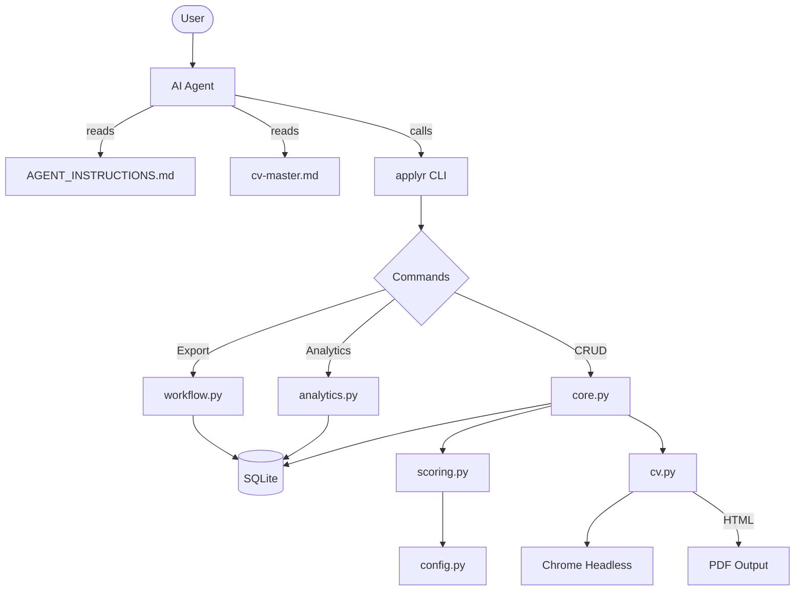

# Architecture

## Overview

applyr is a CLI tool that stores job offers in SQLite and generates ATS-safe CVs. It works **with** AI agents — the agent reads `AGENT_INSTRUCTIONS.md` and calls the CLI. applyr itself makes no LLM API calls.

## Data Flow



## Module Responsibilities

| Module | Lines | Responsibility |
|--------|-------|----------------|
| `cli.py` | 357 | Entry point, argparse routing, global flags (`--json`, `--no-color`) |
| `config.py` | 131 | Load/create `~/.applyr/applyr.toml`, normalize weights, detect Chrome |
| `db.py` | 146 | SQLite schema (offers: 31 columns), enums, migrations, connection management |
| `scoring.py` | 36 | Weighted compatibility calculation — **no database access**, reads config for weights |
| `errors.py` | 20 | `error()`, `warn()`, `die()` — all output to stderr |
| `duplicates.py` | 95 | Title normalization and similarity matching for `add` |
| `cv.py` | 416 | ATS HTML skeleton, Chrome PDF export, recruiter review prompt |
| `colors.py` | ~40 | Colorama wrapper, respects `NO_COLOR` |
| `constants.py` | 67 | All magic numbers, thresholds, column widths |
| `commands/core.py` | 756 | init, setup-agent, add, list, show, update, delete, search |
| `commands/analytics.py` | 753 | pipeline, stats, gaps, followups, trends, summary, compare, plan, salary |
| `commands/workflow.py` | 167 | export, doctor |
| `commands/_helpers.py` | ~50 | Shared: `_bar()`, `_today()`, `_truncate()` |

## Key Design Decisions

### Isolated Scoring Engine

`scoring.py` has no database access and no side effects — it takes a topics dict
and returns an int. That isolation is what makes it trivially testable.

It is not, however, fully I/O-free: it calls `load_config()` to read topic
weights from `~/.applyr/applyr.toml`. Tests must set `APPLYR_HOME` to a temp
directory or patch `load_config`, otherwise they read the developer's real
config and produce machine-dependent results.

```python
def calculate_score(topics: dict) -> int:
    """topics = {"tech_stack": {"score": 80}, ...} → weighted int 0-100"""
```

### Config-First Architecture

All business logic reads from `config.py` which loads `~/.applyr/applyr.toml`. No hardcoded thresholds in business code — everything is configurable.

### Agent-Native Design

applyr doesn't call LLM APIs. Instead, it provides:
1. `AGENT_INSTRUCTIONS.md` — tells agents exactly how to use the CLI
2. `--json` flag on all data commands — structured output for agent parsing
3. Clear, parseable CLI output — agents can read and act on it

### SQLite Schema

31 columns in the `offers` table, 3 total tables (`offers`, `offer_topics`,
`schema_version`). Migration system for forward-compatible schema
changes — see [`contracts.md`](contracts.md) for the exact procedure.

## File Tree

```
applyr/
├── cli.py                 # Entry point
├── config.py              # Configuration management
├── db.py                  # Database layer
├── scoring.py             # Scoring engine (pure)
├── cv.py                  # CV generation + PDF
├── colors.py              # Terminal colors
├── constants.py           # Magic numbers
├── commands/
│   ├── __init__.py        # Exports all cmd_* functions
│   ├── core.py            # CRUD commands
│   ├── analytics.py       # Analytics commands
│   ├── workflow.py        # Export/system commands
│   └── _helpers.py        # Shared utilities
├── templates/
│   ├── AGENT_INSTRUCTIONS.md
│   ├── cv-ats.html
│   └── cv-master-template.md
└── tests/
    ├── test_scoring.py
    ├── test_config.py
    ├── test_db.py
    └── test_validators.py
```
